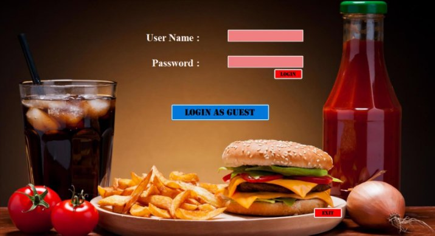
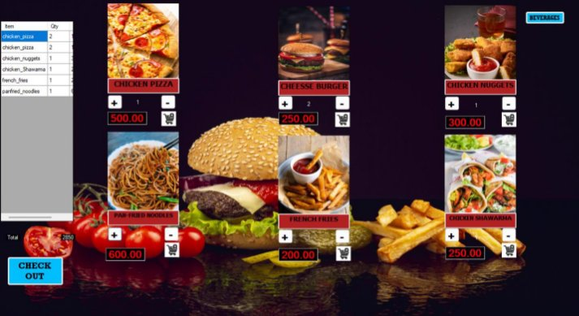
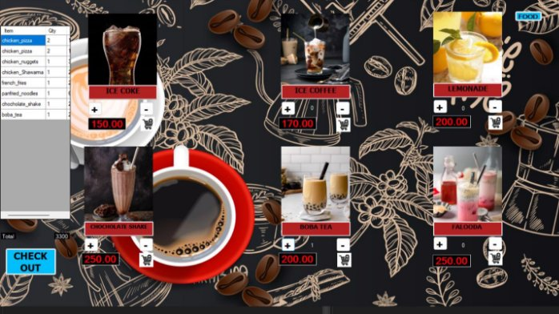
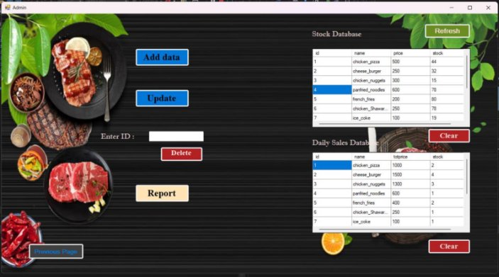
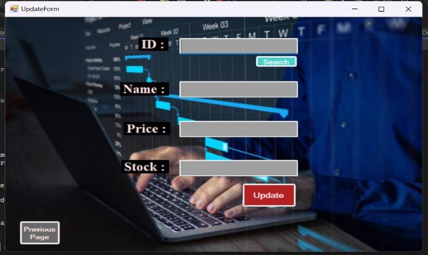
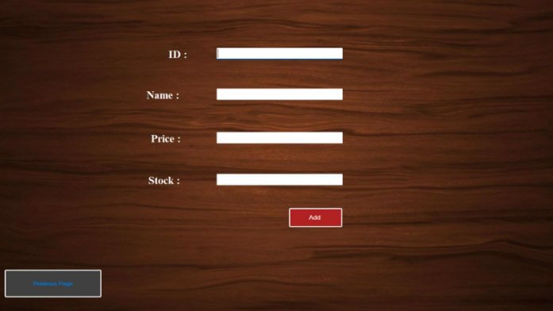

**Restaurants Meals Ordering System **

Welcome to the Restaurant Meal Ordering System! This project is designed to streamline the management of meals, beverages, and administrative operations. Developed using C# and SQL Server Management Studio, the system enables users to order meals and beverages efficiently. Customers can visualize their orders and make changes using the side panel. Administrators can perform various tasks such as adding, deleting, and updating items, as well as generating reports. 

**Features ![ref1]**

- Admin Login: Safe login process for administrator access. 
- Admin Dashboard: Obtain a detailed dashboard that includes all the system's features and functions. 
- Operations: Add, update, delete, and view meals and beverages in the inventory. 
- Issuing meals: Handle meals and beverages issuing process to customers. 
- Generate Reports: Admin can generate daily selling report. 

**Technologies Used **

- C#: A programming language used for developing application logic.  
- SQL  Server  Management  Studio:  A  database  management  system  for  storing  and managing data.  
- Visual Studio: An Integrated Development Environment (IDE) for C# development.  
- GitHub: A platform for version control and project hosting. 

**Project Structure **

/GUI course work: Contains source code files for the Library Management System. /Database/cafedb: Includes SQL scripts and database schema files. 

/README.md: Main documentation file providing project overview and instructions. /Login.txt: Admin username and password. 

/GUI course work/GUI course work.sln: Run this application. 

**Getting Started ![ref1]**

1. Download project or create clone. 
1. Copy database folder to you sever databases store location. (Copy cafedb folder into below location) Ex: If you are using Wamp Server, copy folder to... C:\wamp64\bin\mysql\mysql5.7.36\data 
1. Run the local host server on your pc and login to it. 
1. Open GUI course work.sln and run. 

**Admin Login and User Login** 

**Home Page** 

**Meals Ordering Page** 

**Beverages Ordering Page** 

**Admin Control Panel** 

**Update Items Page** 

**Add Items Page** 

**Admin Generated Reports** 

[ref1]: Aspose.Words.f87ba391-4bb8-457b-9a6b-d8b1fa6a561d.002.png
